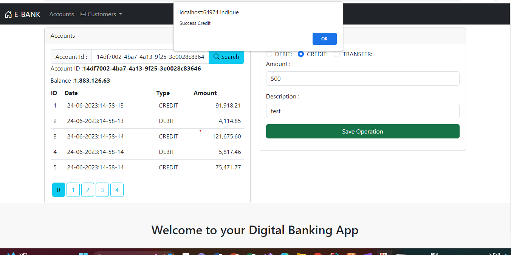

<h1 align="center">Partie Frontend de l'application web Digital Banking</h1>
 

# Interface Home

Cette section d'accueil présente un titre de bienvenue avec un navbar qui propose de différents services à propos des clients et des comptes, tels que l'ajout d'un nouveau client ou la consultation du détail d'un compte.
 
<h1></h1>

 
# Partie Customers

La partie "Customers" offre deux fonctionnalités : la consultation des clients existants(avec une fonctionnalité de recherche par mot clé) et l'ajout de nouveaux clients.

## 1.1- Consultation des clients

 
<h1></h1>

 
Cette page affiche la liste des clients existants. Elle offre également la fonctionnalité de supression du client et de l'affichage du détail du client (en cliquant sur Accounts).

## 1.5- Ajout de nouveaux clients
 
<h1></h1>

 
Un formulaire est affiché avec des champs requis qui permet d'ajouter de nouveaux clients.

# Partie Accounts
La section des comptes bancaires permet de consulter les informations d'un compte spécifique et d'effectuer des opérations.

 

Ci-dessous les détails d'un compte donné (dont l'id est écrit dans la barre de recherche). La section offre également la fonctionnalité d'ajouter une opération quelconque.

 

Après avoir rempli les de l'opération désiré(debit, crédit ou transfert), un message de connfirmation s'affiche afin de confirmer l'enregistrement de l'opération.

 
