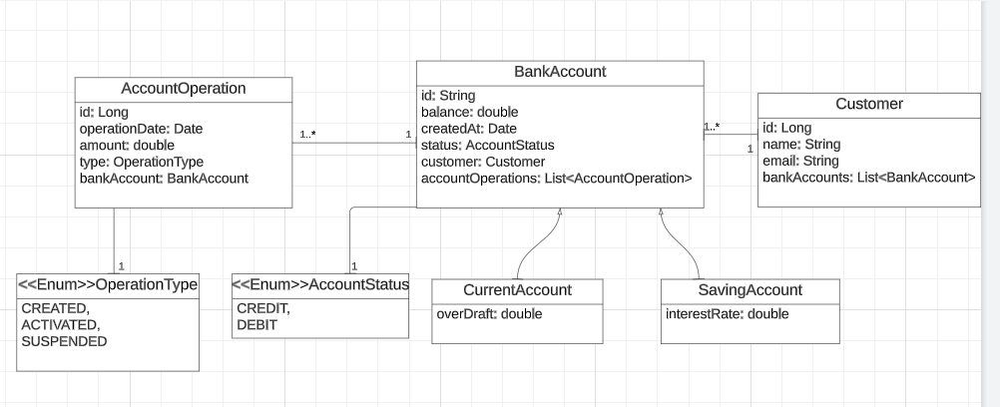

<h1 align="center"> Backend de l'application web Digital Banking</h1>
 

<h3>
Conception et architecture
</h3>
 
<h4>Use Case Diagram</h4>

<h4>Architecture en couche</h4>

Afin d'organiser le travail et faciliter la maintenance, on a suivi l'architecture en couches.
Les principales couches de l'application backend sont:
 
1. Couche DAO (couche de persistance) : Elle contient les Repositories qui fournissent les opérations de base pour interagir avec les entités persistantes. 

2. Entités JPA : Les entités JPA représententt des objets persistants dans une base de données. Les entités de l'application Digital Banking sont les suivantes :
    - Customer
    - BankAccount
    - CurrentAccount 
    - SavingAccount 
    - AccountOperation

3. Couche service : Cette couche représente la logique métier de l'application. Elle utilise les interfaces DAO pour accéder aux données et les mappers pour convertir les entités en DTO (Data Transfer Object) et vice versa.

4. DTOs : Les DTOs sont utilisés pour transférer des données entre la couche web et les entités JPA.

5. RestController : Les RestControllers offrent les services de l'application via des API REST. 

6. Exceptions métier : Ces exceptions sont utilisées pour gérer les erreurs spécifiques à l'application. On a géré les exceptions suivantes :
    - CustomerNotFoundException 
    - BankAccountNotFoundException 
    - BalanceNotSufficientException 

